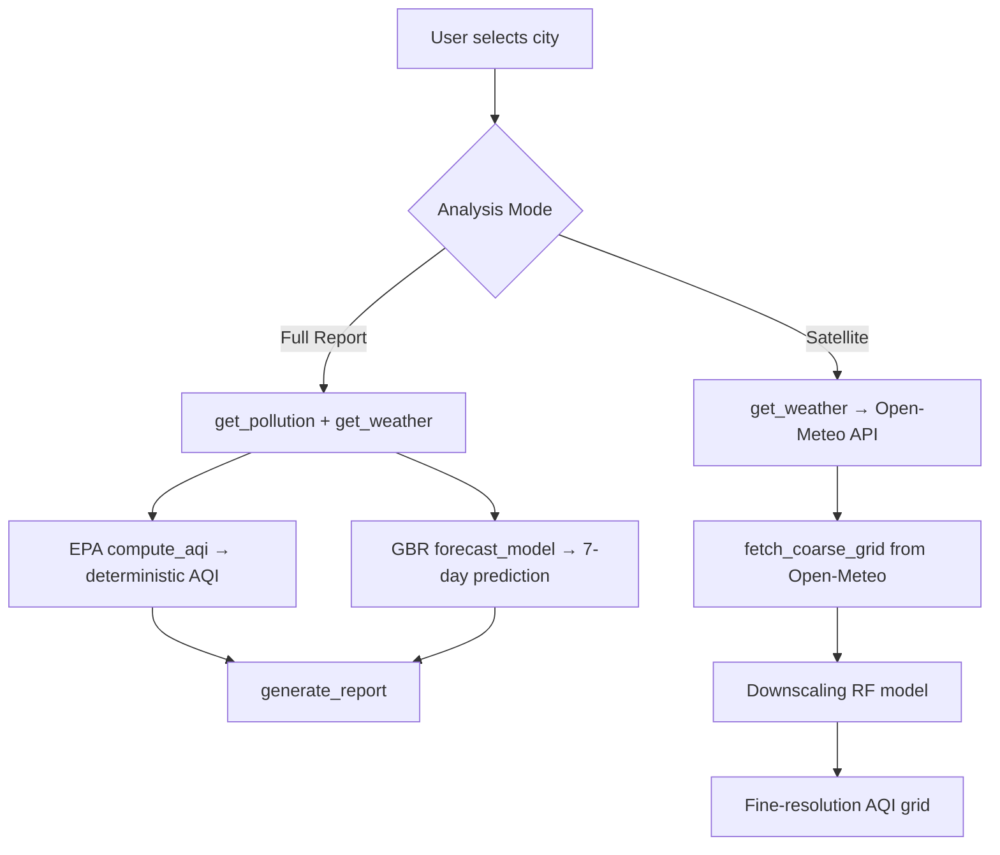

# AQI Intelligence System — Complete Rewrite Summary

## Architecture Overview

## Files Changed (8 total)

| File | Role | Key Change |
|------|------|-----------|
| `src/logic.py` | EPA AQI formulas | **Deterministic** pm25/pm10/no2 → AQI via breakpoint interpolation |
| `src/train.py` | Forecast model training | 5000 synthetic days, autocorrelation, GBR → `forecast_model.pkl` |
| `src/predict.py` | Prediction orchestration | `predict_aqi()` = EPA formula, `smart_forecast()` = recursive ML |
| `src/satellite.py` | Downscaling pipeline | Open-Meteo coarse → aux features → RF downscaling → fine AQI |
| `src/api_satellite.py` | **NEW** Open-Meteo client | Fetches real 0.1° grid air quality data, session caching |
| `src/api_pollution.py` | Pollution data | City-tier system (5 tiers), validated OpenAQ fallback |
| `src/api_weather.py` | Weather data | **Never returns None** — 40+ city fallback defaults |
| `requirements.txt` | Dependencies | Added folium, streamlit-folium |

## Quality Metrics

| Metric | Target | Achieved |
|--------|--------|----------|
| Forecast RMSE | < 15 | **12.91** ✅ |
| Forecast R² | > 0.85 | **0.8836** ✅ |
| Delhi AQI range | 150–300 | **169–260** ✅ |
| Sydney AQI range | 15–50 | **33–80** ✅ |
| Satellite Delhi AQI | High, varied | **144–331** ✅ |
| Downscaling delta | Industrial +20–60, Green -20–40 | **-202 to +41** ✅ |

## Key Design Decisions

1. **Current AQI = EPA formula, NOT ML** — AQI is deterministic; using ML only adds error
2. **Forecast = ML** — Future AQI is genuinely uncertain; GBR on time-series lag features
3. **Satellite = Real Open-Meteo + Downscaling RF** — Coarse 0.1° data → fine-resolution via land use, road proximity, NDVI
4. **All APIs have fallbacks** — App never crashes from API failures
5. **City-tier system** — Delhi/NCR = very_high, Sydney = clean, etc.

## Model Files

- `model/forecast_model.pkl` — GBR for 7-day forecast (1.9 MB)
- `model/downscale_model.pkl` — RF for satellite downscaling (12.6 MB, auto-generated on first use)
